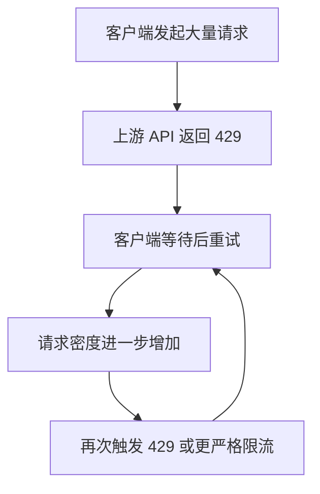
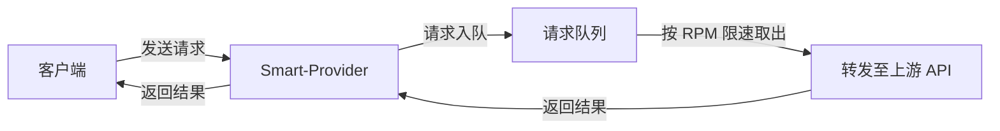
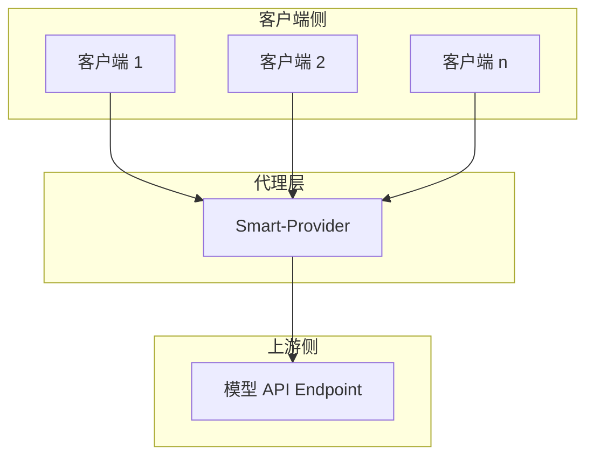

# Smart-Provider

## 项目介绍

Smart-Provider 是一个模型 API 请求代理，位于客户端与真实 API Endpoint 之间。它的核心目标是**平滑请求流量**，尽量避免触发上游 API 的 `429 Too Many Requests` 错误，从而减少因客户端频繁重试而导致的保护机制升级，避免业务长期陷入“重试—等待—再重试—再等待”的低效循环。

简单来说，Smart-Provider 充当了一个“交通信号灯”：当客户端短时间内发起大量请求时，它不会把这些请求一股脑地抛给上游 API，而是先暂存起来，再按照一个合理、可控的速率分批转发。

---

## 为什么需要 Smart-Provider

在直接调用模型 API 时，如果客户端并发较高或突发流量较大，上游 API 很容易返回 `429` 限流响应。一旦触发限流，客户端通常会自动重试，而重试又会进一步增加请求密度，形成恶性循环：



这种循环会导致以下问题：

- **响应延迟显著增加**：大量请求被阻塞在重试队列中。
- **可用性下降**：持续触发限流时，部分请求可能被丢弃或超时。
- **成本不可控**：无效的重试会浪费计算资源和网络带宽。

Smart-Provider 通过引入一层**请求缓冲与速率控制**，从根本上降低触发限流的概率。

---

## 核心术语

### RPM（Requests Per Minute）

RPM 即“每分钟请求数”，表示在 1 分钟内可以向上游 API 发送的请求数量。例如，RPM 限制为 60 时，平均每秒最多发送 1 个请求。这是模型 API 最常见的限流维度之一。

### TPM（Tokens Per Minute）

TPM 即“每分钟 Token 数”，表示在 1 分钟内可以传输的 Token 总量。Token 是模型处理文本的基本单位，通常与输入和输出的字符量相关。TPM 更适合控制大段文本或长对话场景下的流量。

---

## Smart-Provider 的工作原理

Smart-Provider 的工作方式可以理解为“先排队，再放行”。当客户端发送请求时，代理不会立即转发给上游 API，而是先把请求放入一个内部队列，然后按照预先配置的速率（当前阶段为 RPM）逐步取出并发送：



通过这种方式，上游 API 接收到的请求速率始终被控制在一个安全范围内，从而大幅降低触发 `429` 的风险。

---

## 架构设计

Smart-Provider 采用**独立代理服务**的形态部署在客户端与上游 API 之间，对客户端透明，并统一承担请求缓冲与速率控制职责。其核心组件包括：

- **请求接入层**：接收客户端请求，解析并封装为内部上下文，最终将上游响应返回给对应客户端。
- **请求队列**：内存中的 FIFO 队列，用于暂存待转发请求，并提供容量上限保护。
- **限速器**：基于滑动窗口统计最近一分钟内的已发送请求数，按配置的 RPM 阈值决定是否放行。
- **上游转发层**：在限速器放行后，将请求顺序转发至真实上游 API，处理超时与错误分类。
- **配置管理**：提供上游地址、RPM 限制、队列容量、超时时间等运行时参数。
- **可观测性**：暴露队列长度、已处理请求数、上游 429/5xx 次数等指标，并记录关键事件日志。

### 关键决策

- **部署形态**：独立代理服务，便于集中管控与独立扩缩容。
- **队列模型**：首期采用内存 FIFO 队列，兼顾实现复杂度与性能。
- **限速算法**：滑动窗口 RPM 限制，避免固定窗口边界的突发尖峰。
- **转发策略**：顺序同步转发，保持请求/响应的一一对应关系。

### 部署视图



### 扩展路线图

| 阶段 | 能力 | 说明 |
|------|------|------|
| 1 | RPM 限速 | 本期核心目标，基于滑动窗口控制每分钟请求数。 |
| 2 | TPM 限速 | 在 RPM 基础上引入 Token 计数，覆盖长文本场景。 |
| 3 | 优先级队列 | 为不同客户端或请求类型分配优先级。 |
| 4 | 熔断器 | 在上游持续异常时快速失败，避免无效请求堆积。 |
| 5 | 分布式限速 | 多实例间共享限速状态，支持横向扩展。 |

---

## 配置

Smart-Provider 通过环境变量或 `.env` 文件加载运行时配置。所有环境变量以 `SMART_PROVIDER_` 为前缀，启动时会进行类型与范围校验。

最小示例：

```bash
export SMART_PROVIDER_UPSTREAM_URL=https://api.example.com/v1
export SMART_PROVIDER_RATE_LIMIT_RPM=120
```

或在项目工作目录创建 `.env` 文件：

```bash
SMART_PROVIDER_UPSTREAM_URL=https://api.example.com/v1
SMART_PROVIDER_RATE_LIMIT_RPM=120
```

完整配置说明参见 [docs/configuration.md](docs/configuration.md)，开发者扩展指南参见 [docs/config-module.md](docs/config-module.md)。

## 阶段性目标

当前阶段，Smart-Provider 优先实现 **RPM 限速**，原因如下：

- 请求次数是触发 `429` 最直接、最敏感的指标。
- 控制 RPM 能够迅速缓解大多数突发流量导致的限流问题。
- 实现复杂度适中，便于快速验证核心思路。

TPM 限速将在后续阶段纳入规划，以覆盖更长文本和更复杂场景下的流量控制需求。

---

## 预期效果

使用 Smart-Provider 后，预期可以带来以下改善：

- **降低 429 触发频率**：通过主动限速，避免 upstream 保护机制被激活。
- **提升请求稳定性**：减少因重试导致的延迟抖动和请求失败。
- **改善用户体验**：客户端获得更可预测的响应时间，业务逻辑更顺畅。
- **为后续扩展打基础**：在 RPM 验证通过后，可逐步引入 TPM、优先级队列、熔断等高级能力。
