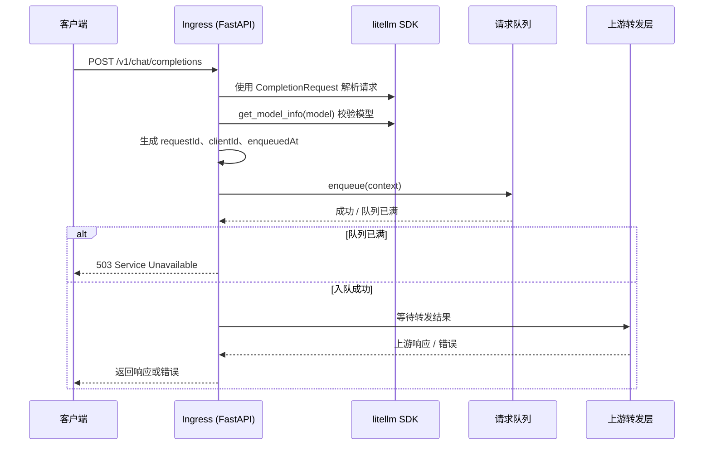

## Context

Smart-Provider 的编码实现指导文档建议在 `src/ingress/` 中实现请求接入层，职责包括：接收客户端请求、构造内部请求上下文、将上下文入队、等待转发结果并返回给客户端。当前项目已创建 `src/ingress/` 目录，但尚未实现代码。

本次变更将使用 Python 与 litellm SDK 实现 Ingress 模块。litellm 已提供 OpenAI 兼容的请求类型、模型信息校验、异常分类与日志回调等能力，因此 Ingress 应优先复用这些能力，避免自行实现协议解析与错误码映射。

## Goals / Non-Goals

**Goals：**
- 实现一个可运行的 Ingress 模块，作为 Smart-Provider 的客户端入口。
- 暴露 OpenAI 兼容的 chat/completions 接口，接收客户端请求。
- 使用 litellm SDK 完成请求解析、模型校验、异常分类与日志记录。
- 将请求封装为项目内部上下文并提交给请求队列。
- 在队列已满或请求异常时返回明确的错误响应。

**Non-Goals：**
- 不实现请求队列、限速器、上游转发器等其它模块（仅实现与它们的集成接口）。
- 不使用 litellm 的 `completion()` 或 `acompletion()` 直接完成上游转发（该职责属于 Forwarder）。
- 不覆盖除 chat/completions 之外的其它 OpenAI 端点。
- 不讨论部署、扩容或持久化等运维细节。

## Decisions

### 1. 使用 FastAPI 暴露 HTTP 端点

**决策**：Ingress 使用 FastAPI 框架暴露 `/v1/chat/completions` 端点。

**理由**：
- FastAPI 原生支持异步处理与自动生成的 OpenAPI 文档，适合作为模型 API 代理入口。
- 与 litellm proxy 的端点约定一致，客户端无需修改即可接入。

**替代方案**：直接使用 litellm proxy 作为入口。litellm proxy 已具备完整的 OpenAI 兼容层，但它是完整的代理服务，会绕过 Smart-Provider 自有的队列与限速器。因此本次仅将 litellm 作为 SDK 使用，而不是直接部署 litellm proxy。

### 2. 使用 litellm 的 CompletionRequest 解析请求

**决策**：Ingress 使用 `litellm.types.completion.CompletionRequest` 对客户端请求体进行解析与校验。

**理由**：
- litellm 已提供与 OpenAI 兼容的请求模型，字段覆盖 `model`、`messages`、`temperature`、`stream` 等常见参数。
- 复用该模型可避免自行维护一套 OpenAI 请求 schema，减少字段遗漏与类型错误。

**不自行实现的内容**：
- 请求体 JSON schema 校验。
- 参数默认值与取值范围校验（litellm 在后续调用中会处理）。

### 3. 使用 litellm 获取模型信息

**决策**：Ingress 在解析请求后，使用 litellm 提供的模型信息工具（如 `litellm.get_model_info()`）校验模型名称是否可识别。

**理由**：
- litellm 维护了常见模型与 provider 的映射关系，可提前发现错误的模型名称。
- 该校验属于 Ingress 的输入校验职责，避免无效请求进入队列。

**注意**：Ingress 仅校验模型存在性，不做成本计算或 TPM 统计；TPM 属于后续阶段能力。

### 4. 使用 litellm 的异常类型进行错误分类

**决策**：Ingress 内部错误与上游相关错误统一使用 `litellm.exceptions` 下的异常类型表达。

**理由**：
- litellm 的异常类型已与 OpenAI 异常对齐（如 `BadRequestError`、`RateLimitError`、`Timeout` 等），便于返回标准状态码。
- 未来 Forwarder 使用 litellm 调用上游时，可直接抛出/捕获同类异常，保持一致性。

**错误映射建议**：

| 场景 | 使用的 litellm 异常 | 建议 HTTP 状态码 |
|------|---------------------|------------------|
| 请求体解析失败 | `BadRequestError` | 400 |
| 模型不存在 | `NotFoundError` 或 `BadRequestError` | 404 / 400 |
| 队列已满 | `ServiceUnavailableError` | 503 |
| 上游超时 | `Timeout` | 504 |
| 上游 429 | `RateLimitError` | 429 |
| 上游 5xx | `InternalServerError` / `ServiceUnavailableError` | 502 / 503 |

### 5. 内部请求上下文使用项目自定义对象

**决策**：尽管 litellm 提供了请求对象，Ingress 仍需将客户端请求转换为 Smart-Provider 内部请求上下文，再提交给队列。

**上下文字段**：

| 字段 | 来源 | 说明 |
|------|------|------|
| requestId | 生成 | UUID，全局唯一。 |
| clientId | 请求头 | 从自定义请求头（如 `X-Client-Id`）提取，默认值待配置。 |
| enqueuedAt | 生成 | 请求入队时的时间戳。 |
| upstreamTarget | 配置 | 目标上游 API 地址。 |
| model | 请求体 | 客户端请求的模型名称。 |
| messages | 请求体 | litellm CompletionRequest 中的 messages。 |
| extraBody / extraHeaders | 请求体 | 透传给上游的额外参数。 |
| stream | 请求体 | 是否流式响应。 |
| maxWaitTime | 配置 | 请求在队列中最大等待时间。 |

**理由**：
- 内部上下文与 litellm 请求对象解耦，便于队列、限速器、转发器独立演进。
- 保留 `requestId`、`clientId`、`enqueuedAt` 等 Smart-Provider 特有的元数据。

### 6. 使用 litellm 的回调机制记录日志

**决策**：Ingress 通过 litellm 的日志/回调机制记录请求接收、入队与错误事件。

**理由**：
- litellm 提供了统一的日志接口与回调钩子，便于后续接入不同后端。
- 避免 Ingress 直接依赖具体日志库，保持模块可替换性。

**不自行实现的内容**：
- 日志格式化。
- 日志后端写入逻辑。

### 7. 同步等待转发结果

**决策**：Ingress 在将上下文入队后，同步等待转发结果（通过 Future、队列或事件机制），再将结果返回给客户端。

**理由**：
- 与架构设计中的顺序同步转发一致，保持请求/响应的一一对应关系。
- 首期不考虑流式响应的复杂处理；若客户端请求 `stream=true`，可先返回非流式响应或拒绝流式请求。

## 模块接口

### Ingress 对外暴露

- `POST /v1/chat/completions`：接收 OpenAI 兼容请求，返回模型响应或错误。

### Ingress 对内依赖

- `Queue.enqueue(context) -> EnqueueResult`：提交请求上下文，返回成功或队列已满。
- `Future[ForwarderResult]` 或等效机制：等待转发结果。
- `Config`：读取 `server.port`、`upstream.url`、`queue.maxSize`、`forwarder.timeout` 等配置。

## 请求处理流程

## Risks / Trade-offs

- **[风险] litellm 版本兼容性** → 缓解：在依赖声明中锁定 litellm 主版本号，升级时回归 Ingress 测试。
- **[风险] 流式响应支持复杂** → 缓解：首期不实现流式响应，对 `stream=true` 返回明确错误或不支持的提示。
- **[风险] 过度依赖 litellm 类型** → 缓解：内部上下文与 litellm 请求对象解耦，未来替换成本可控。
- **[权衡] 自行实现 HTTP 服务 vs. 使用 litellm proxy** → 选择 FastAPI + litellm SDK 以保留对队列与限速器的控制权。

## Open Questions

- 客户端身份识别（`clientId`）具体从哪个请求头提取？是否需要支持多个提取策略？
- 流式响应是否在首期完全禁止，还是先返回非流式降级？
- Ingress 是否需要支持除 `chat/completions` 之外的 OpenAI 端点（如 `/v1/models`、`/v1/embeddings`）？
