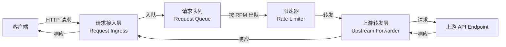
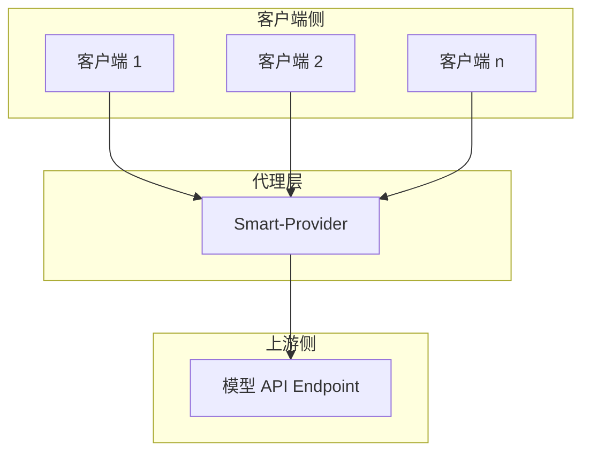

## Context

Smart-Provider 定位为模型 API 请求代理，部署在客户端与真实 API Endpoint 之间。README.md 已阐明其核心目标：通过“请求缓冲 + 速率控制”平滑突发流量，降低上游 API 返回 `429 Too Many Requests` 的概率，避免重试风暴。

当前项目仅包含 README.md，尚未形成可指导实现的架构设计。为了让后续实现少走弯路，需要先明确：
- 代理应以何种形态运行（独立服务 / 库 / 边车）。
- 请求队列与限速器如何协同工作。
- 如何在不侵入客户端代码的前提下完成协议适配。
- 如何观测限速效果并支持后续扩展（TPM、优先级、熔断等）。

本设计文档基于 README.md 的核心目标展开，所有结论均以文字与图示表达，不涉及具体代码。

## Goals / Non-Goals

**Goals：**
- 明确 Smart-Provider 的总体架构、核心组件与组件间交互关系。
- 定义请求从客户端进入代理、排队、限速、转发、返回的完整数据流。
- 确定首期 RPM 限速的算法选型与配置语义。
- 给出部署视图与扩展路线图，使后续迭代有据可依。
- 产出物全部为设计文档，便于评审与归档。

**Non-Goals：**
- 不实现任何可执行代码、测试代码或配置文件。
- 不深入讨论具体编程语言、框架版本或第三方库选型。
- 不涵盖 TPM 限速、优先级队列、熔断器等后续能力的详细实现，仅作为扩展点预留。

## Decisions

### 1. 部署形态：独立代理服务

**决策**：Smart-Provider 以独立进程/服务的形式部署在客户端与上游 API 之间。

**理由**：
- 对客户端透明，客户端只需将目标地址指向代理，无需修改业务代码。
- 便于集中管理速率限制、日志、监控与配置。
- 可以独立扩缩容，与上游 API 的客户端数量解耦。

**替代方案**：以 SDK 或中间件形式嵌入客户端。该方案虽然延迟更低，但需要在每个客户端中维护限速逻辑，无法统一管控，与“平滑整体流量”的目标冲突，因此不作为首期方案。

### 2. 队列模型：内存优先的 FIFO 队列

**决策**：首期采用内存中的 FIFO（先进先出）请求队列。

**理由**：
- 实现复杂度适中，能够快速验证 RPM 限速的核心思路。
- 单节点场景下性能足够，且不需要引入外部持久化依赖。
- FIFO 符合“公平处理”的直觉，避免早期过度设计优先级策略。

**替代方案**：持久化队列（Redis/RabbitMQ）。该方案可提升可靠性，但引入外部依赖，增加部署复杂度；优先级队列虽更灵活，但属于后续阶段目标，本期不实现。

### 3. 限速算法：滑动窗口 RPM 限制

**决策**：首期采用基于滑动时间窗口的 RPM 限速算法。

**理由**：
- 与上游 API 通常以“每分钟请求数”为限流维度直接对应，语义清晰。
- 滑动窗口相比固定窗口能避免窗口边界处的突发尖峰，流量更平滑。
- 算法状态简单，可在内存中维护，无需外部存储。

**替代方案**：令牌桶/漏桶。令牌桶更适合限制突发流量并允许一定 burst，但上游 API 通常直接以 RPM 作为硬限制，滑动窗口更容易与之对齐；漏桶更偏向输出速率整形，实现相对复杂，留待后续评估。

### 4. 转发策略：同步等待 + 顺序出队

**决策**：队列中的请求按顺序出队，每个请求转发后等待响应，再将结果返回给对应客户端。

**理由**：
- 保持请求/响应的一一对应关系，简化客户端集成。
- 顺序出队配合 RPM 限速，可直接控制单位时间内向上游发送的请求数量。

**替代方案**：异步流水线批量转发。虽然吞吐更高，但会增加响应关联复杂度，且上游 API 通常按单请求计费/限流，批量转发优势不明显。

### 5. 可观测性：核心指标暴露

**决策**：至少暴露队列长度、已处理请求数、被限速等待时间、上游 429/5xx 次数四项核心指标，并通过结构化日志记录关键事件。

**理由**：
- 这些指标足以验证 RPM 限速是否生效、是否真正减少了 429。
- 日志可用于排查请求阻塞与超时问题。

## 系统架构

**组件说明**：

- **Request Ingress（请求接入层）**：接收客户端请求，完成协议适配、请求解析与上下文封装，并将请求放入队列。待上游响应返回后，负责把结果回传给对应客户端。
- **Request Queue（请求队列）**：暂存待转发的请求，按 FIFO 顺序出队。队列长度可作为背压信号，防止无限堆积。
- **Rate Limiter（限速器）**：基于滑动窗口维护每分钟已发送请求数，决定是否允许当前请求出队。若超限，请求继续等待。
- **Upstream Forwarder（上游转发层）**：在限速器放行后，将请求发送至真实上游 API，并等待响应。负责处理网络超时、连接复用与错误分类。
- **Configuration（配置管理）**：提供运行时配置，包括目标上游地址、RPM 限制值、队列容量、超时时间等。
- **Observability（可观测性）**：输出指标与日志，用于监控限速效果与系统健康度。

## 数据流

1. 客户端向 Smart-Provider 发送模型 API 请求。
2. 请求接入层解析请求并生成内部上下文（请求 ID、入队时间、客户端标识等）。
3. 请求被加入 FIFO 队列；若队列已满，返回明确的队列已满响应，避免继续堆积。
4. 限速器按滑动窗口检查当前分钟内的已发送请求数：
   - 若未超过 RPM 限制，允许出队。
   - 若已超过，请求继续等待，直到下一时间窗口放行。
5. 上游转发层将放行请求发送至上游 API，并等待响应。
6. 上游响应经请求接入层返回给对应客户端。
7. 可观测性组件记录队列长度、等待时间、转发结果等数据。

## 部署视图

- 多个客户端共享同一个 Smart-Provider 实例，统一受 RPM 限速保护。
- 代理与上游 API 之间保持稳定的出队速率，降低触发 429 的概率。
- 当单实例性能不足时，可通过前置负载均衡部署多实例；多实例场景下限速需要考虑分布式状态同步，本期先按单实例设计，后续作为扩展点。

## 扩展路线图

| 阶段 | 能力 | 说明 |
|------|------|------|
| 1 | RPM 限速 | 本期核心目标，基于滑动窗口控制每分钟请求数。 |
| 2 | TPM 限速 | 在 RPM 基础上引入 Token 计数，覆盖长文本场景。 |
| 3 | 优先级队列 | 为不同客户端或请求类型分配优先级。 |
| 4 | 熔断器 | 在上游持续异常时快速失败，避免无效请求堆积。 |
| 5 | 分布式限速 | 多实例间共享限速状态，支持横向扩展。 |

## Risks / Trade-offs

- **[风险] 单点性能瓶颈** → 缓解：首期按单实例设计，队列长度与并发数可作为容量评估依据；未来通过负载均衡与分布式限速横向扩展。
- **[风险] 队列过长导致客户端超时** → 缓解：配置最大队列长度与请求最大等待时间，超限及时拒绝，避免无意义等待。
- **[风险] 上游 API 本身存在突发限流策略** → 缓解：在限速器中加入安全余量（如按上游 RPM 的 80% 设置），并保留 429 时的退避重试能力。
- **[权衡] 内存队列的可靠性** → 选择内存队列是为了降低初期复杂度；若后续需要断点续传或持久化，可替换为外部队列，接口层需预留抽象。
- **[权衡] 同步转发 vs. 吞吐** → 顺序同步转发可能限制峰值吞吐，但符合 RPM 控制目标，实现简单；高吞吐需求可在后续引入有限并发。

## Open Questions

- 是否需要支持上游 API 的多模型/多 Endpoint 配置？若支持，限速维度是按全局还是按 Endpoint 独立计算？
- 客户端身份识别策略：是否基于 IP、API Key 还是请求头中的其他字段进行分组限速？
- 请求/响应体是否需要在代理层解析以统计 Token 数，还是仅作透传？
