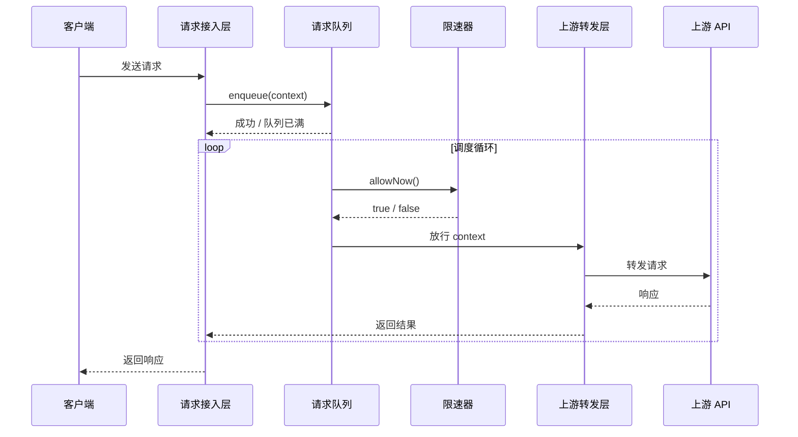

## Context

Smart-Provider 的架构设计（归档于 `openspec/changes/archive/2026-06-19-smart-provider-architecture-design/`）已经明确了以下核心结论：

- 部署形态为独立代理服务，对客户端透明。
- 核心组件包括请求接入层、请求队列、限速器、上游转发层、配置管理与可观测性。
- 首期采用内存 FIFO 队列 + 滑动窗口 RPM 限速 + 顺序同步转发。
- 可观测性至少覆盖队列长度、已处理请求数、上游 429/5xx 次数与等待时间。

本设计文档在架构设计的基础上进一步展开，面向编码实现阶段，给出每个模块的实现要点、数据语义、接口契约与协作顺序。所有内容以文字、表格与伪代码逻辑描述，不涉及具体编程语言或框架代码。

## Goals / Non-Goals

**Goals：**
- 为后续编码实现提供可直接参考的技术指导文档。
- 明确各模块的职责边界、输入输出与关键数据结构语义。
- 详细说明滑动窗口 RPM 限速算法的实现步骤与边界条件。
- 定义模块间接口契约、错误处理策略与测试覆盖建议。
- 给出运行时配置项、加载方式与默认值建议。

**Non-Goals：**
- 不实现任何可执行代码、测试代码或配置文件。
- 不指定具体编程语言、框架或第三方库。
- 不讨论 TPM、优先级队列、熔断器、分布式限速等后续能力的实现细节。

## Decisions

### 1. 项目目录结构按组件职责划分

**决策**：代码目录按架构组件划分，每个组件拥有独立模块，降低耦合。

**建议结构**：

```
smart-provider/
├── src/
│   ├── ingress/          # 请求接入层
│   ├── queue/            # 请求队列
│   ├── limiter/          # 限速器
│   ├── forwarder/        # 上游转发层
│   ├── config/           # 配置管理
│   └── observability/    # 可观测性（日志、指标）
├── tests/                # 测试
└── docs/                 # 说明文档
```

**理由**：
- 与架构图中的组件一一对应，便于开发人员快速定位实现位置。
- 各模块可独立测试，降低集成风险。

### 2. 请求上下文统一封装

**决策**：所有模块通过统一的请求上下文对象传递请求信息，上下文在请求接入层创建，并随请求生命周期传递。

**上下文语义**：

| 字段 | 类型语义 | 说明 |
|------|----------|------|
| requestId | 字符串 | 全局唯一请求标识，建议采用 UUID。 |
| clientId | 字符串 | 客户端标识，可用于后续分组限速。 |
| enqueuedAt | 时间戳 | 请求进入队列的时间，用于计算等待时间。 |
| upstreamTarget | 字符串 | 目标上游 API Endpoint 地址。 |
| headers | 键值映射 | 上游请求所需的请求头，透传即可。 |
| body | 字节流/对象 | 请求体，代理层不解析语义，仅作透传。 |
| maxWaitTime | 时长 | 请求在队列中最大允许等待时间。 |

**理由**：
- 将请求元数据与上游请求内容分离，便于限速器、队列、转发层各司其职。
- 统一上下文避免各模块重复解析请求。

### 3. 队列与限速器解耦

**决策**：请求队列只负责存储与 FIFO 出队，限速逻辑由独立的限速器模块负责。队列通过询问限速器决定是否放行。

**协作语义**：
- 队列：提供 `enqueue(context)`、`dequeue()`、`size()` 操作。
- 限速器：提供 `allowNow()` 或 `tryAcquire()` 操作，返回是否允许放行。
- 调度循环：持续检查队列非空且限速器允许放行，则出队并交给转发器。

**理由**：
- 职责单一，便于分别测试队列容量与限速算法。
- 未来替换限速算法（如 TPM、分布式限速）时无需修改队列实现。

### 4. 滑动窗口 RPM 算法使用请求时间戳队列

**决策**：限速器内部维护一个最近一分钟内已放行请求的时间戳队列，每次放行前清理过期时间戳并判断是否达到 RPM 上限。

**算法步骤**：
1. 当前时间记为 `now`。
2. 移除时间戳队列中所有小于 `now - 60s` 的时间戳。
3. 若队列长度小于 RPM 限制，允许放行并将 `now` 加入队列。
4. 若队列长度已达到 RPM 限制，阻止放行。

**理由**：
- 与架构设计中的滑动窗口决策一致。
- 时间戳队列直观、可测试，易于扩展为按客户端分组。

### 5. 上游转发器保持同步阻塞等待

**决策**：每个放行请求由转发器同步发送至上游并等待响应，响应返回后再处理下一个请求。

**理由**：
- 与架构设计中的顺序同步转发一致，简化请求/响应关联。
- 在 RPM 限速场景下，单线程顺序处理通常已足够；如需提升吞吐，可在后续引入有限并发，但首期建议保持简单。

### 6. 可观测性通过事件收集

**决策**：队列、限速器、转发器在关键状态变化时发送事件，由可观测性模块统一收集并输出指标与日志。

**关键事件**：
- `RequestEnqueued`：请求入队。
- `RequestDequeued`：请求出队/放行。
- `RequestForwarded`：请求成功转发。
- `UpstreamError`：上游返回错误或超时。
- `QueueFull`：队列容量超限。

**理由**：
- 避免各模块直接依赖日志/指标库，保持模块纯净。
- 事件语义清晰，便于后续接入不同的指标后端。

## 模块实现指南

### 请求接入层（Ingress）

**职责**：接收客户端请求、构造请求上下文、将上下文入队、将上游响应返回给客户端。

**实现要点**：
- 监听客户端请求入口（如 HTTP 服务）。
- 从请求头或连接信息中提取 `clientId`（具体策略待后续确定）。
- 生成 `requestId` 并记录 `enqueuedAt`。
- 调用队列的 `enqueue(context)`，若返回队列已满，则返回明确的错误响应。
- 等待转发完成事件或超时事件，将结果回写客户端。

### 请求队列（Queue）

**职责**：按 FIFO 暂存请求上下文，提供容量保护。

**实现要点**：
- 内部使用线程安全的队列结构。
- `enqueue` 在容量未满时返回成功，否则返回队列已满信号。
- `dequeue` 仅在被调用时移除队首元素，不主动阻塞。
- 暴露 `size()` 供可观测性使用。

### 限速器（Rate Limiter）

**职责**：基于滑动窗口判断当前是否可放行请求。

**实现要点**：
- 维护一个时间戳集合/队列，记录最近一分钟内已放行请求的时间戳。
- 提供 `allowNow()` 方法，按算法步骤清理过期时间戳并判断。
- RPM 限制值从配置读取，启动后按当前值运行。

### 上游转发层（Forwarder）

**职责**：将放行的请求发送至上游 API，等待响应并分类错误。

**实现要点**：
- 从上下文中提取目标地址、请求头与请求体，构造上游请求。
- 设置连接超时与读取超时。
- 收到响应后，将状态码与响应体回传；若超时或网络异常，返回超时错误。
- 对 429 与 5xx 进行显式分类并上报事件。

### 配置管理（Configuration）

**职责**：加载并暴露运行时配置。

**建议配置项**：

| 配置项 | 语义 | 示例 |
|--------|------|------|
| upstream.url | 上游 API 地址 | https://api.example.com/v1 |
| rateLimit.rpm | RPM 限制值 | 60 |
| queue.maxSize | 队列最大容量 | 1000 |
| forwarder.timeout | 上游请求超时（毫秒） | 30000 |
| server.port | 代理服务监听端口 | 8080 |

### 可观测性（Observability）

**职责**：订阅事件并输出日志与指标。

**实现要点**：
- 维护计数器：队列长度、已处理请求数、上游 429 次数、上游 5xx 次数。
- 在 `RequestDequeued` 时计算并记录等待时间。
- 日志输出建议包含 `requestId`、事件类型、时间戳与关键字段。

## 接口契约

### 模块间调用顺序



### 队列与限速器交互

- 队列不主动调用限速器；由独立的调度循环负责协调。
- 调度循环每隔一段极短间隔（如 10-50ms）检查一次：若队列非空且 `allowNow()` 为 true，则出队并交给转发器。

### 转发器与接入层交互

- 转发器完成上游请求后，通过回调、通道或 Future 机制将结果返回给接入层。
- 接入层根据 `requestId` 将结果回写给对应客户端连接。

## 错误处理

### 错误分类

| 类别 | 触发条件 | 建议响应 |
|------|----------|----------|
| 队列已满 | 队列长度达到 `queue.maxSize` | 返回服务暂时不可用，建议客户端稍后重试。 |
| 上游超时 | 上游在 `forwarder.timeout` 内未响应 | 返回网关超时错误。 |
| 上游 429 | 上游返回 429 Too Many Requests | 记录事件并返回上游原始响应或自定义退避提示。 |
| 上游 5xx | 上游返回 5xx | 记录事件并透传上游响应。 |

### 安全余量

- 建议将 `rateLimit.rpm` 设置为上游公告 RPM 的 80% 左右，留出缓冲空间。
- 当收到上游 429 时，可记录告警并考虑短时暂停放行，避免进一步激化限流。

## 测试策略

### 单元测试

- **队列测试**：验证 FIFO 顺序、容量上限、超限拒绝。
- **限速器测试**：验证滑动窗口清理、RPM 上限、窗口边界无突发。
- **转发器测试**：验证超时处理、错误分类、响应透传。

### 集成测试

- **端到端限速测试**：以高于 RPM 的速率发送请求，验证代理是否将请求平滑到 RPM 以下。
- **队列满载测试**：持续发送请求直至队列满，验证后续请求被拒绝。
- **上游异常测试**：模拟上游 429/5xx/超时，验证错误响应与事件记录。

### 验证指标

- 运行测试后检查：队列最大长度、实际 QPS 是否接近 RPM/60、429 次数是否显著减少。

## Risks / Trade-offs

- **[风险] 调度循环空转** → 缓解：采用带等待/通知机制的调度，避免高频空转；或在无请求时让循环休眠。
- **[风险] 请求上下文生命周期管理复杂** → 缓解：明确上下文创建、传递、销毁的责任方，建议使用不可变对象。
- **[风险] 单线程转发吞吐不足** → 缓解：首期按同步顺序实现，后续可引入有限并发池，但需重新评估对 RPM 精度的影响。
- **[权衡] 配置动态更新** → 首期建议启动时加载一次；RPM 动态调整可作为后续增强。
